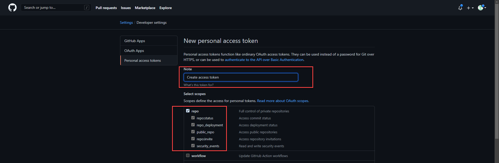
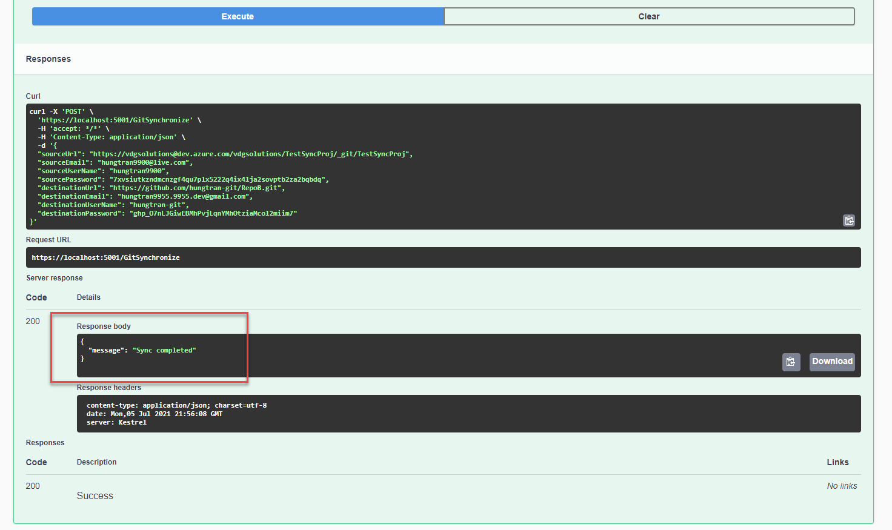
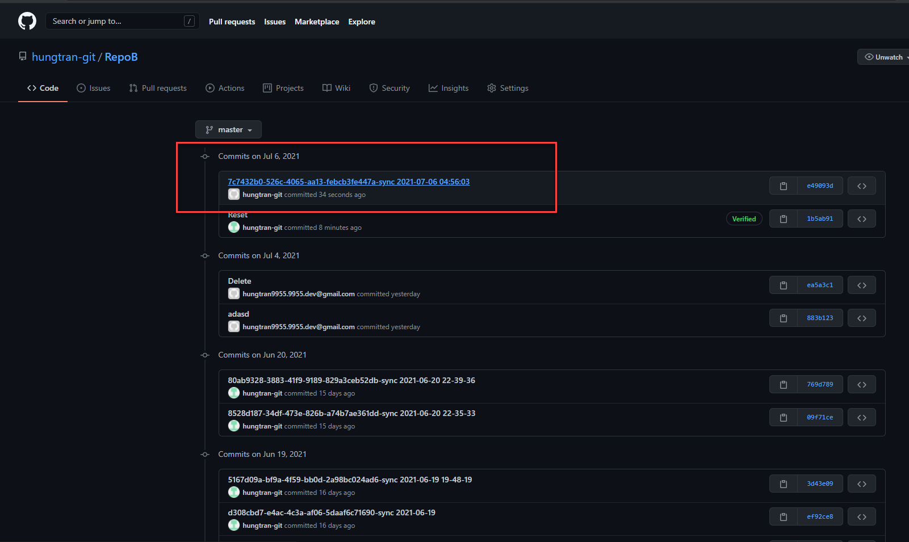

# VDG-git-sync

## 1. Chuẩn bị Project cho việc đồng bộ

- Project có thể là GitHub repos hoặc Azure repos

1. Lấy đường dẫn project nguồn
   Github:
   
   Azure:
   
   
2. Lấy credential project nguồn
   Username:
   Github:
   
   Azure:
   
   Password:
   Github:
   
   
   
   
   
   
   
   Azure:
   
   
   Email:
   Github:
   
   Azure:
   
3. Tương tự cho project đích

# 2. Tiến hành đồng bộ

1. Kiểm tra trạng thái ban đầu project đích
   
2. Gởi request đồng bộ
   
   
3. Kiểm tra sau khi hoàn tất
   
